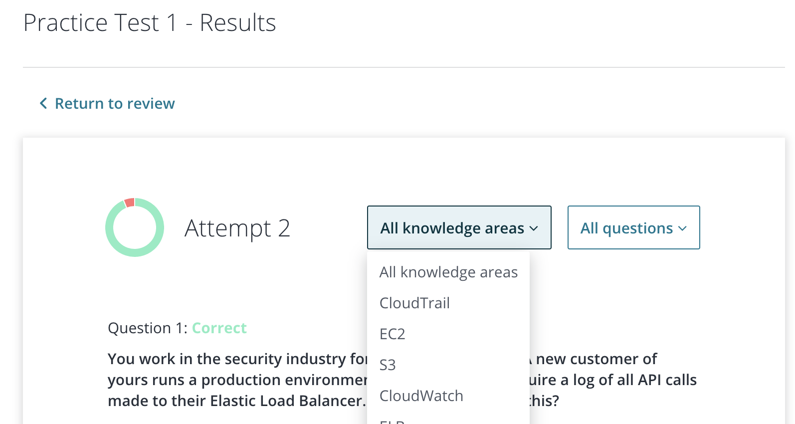

# Intro

Amazon Web Services Solutions Architect exam "is intended for individuals who perform a solutions architect role and have one or more years of hands-on experience designing available, cost-efficient, fault-tolerant, and scalable distributed systems on AWS". It covers services such as S3, EC2, and VPC.

Disclaimer: **I did not take the exam** :sweat_smile:. I was scheduled to take the exam right when coronavirus ramped up in the US and I have not taken it officially yet. The exam will go through an official change after March 22, 2020 so I'm afraid I won't be taking it for a month or so at least.

If your goal is to learn about AWS then this post isn't for you. As a matter of fact, this certification probably isn't for you. One thing I learned in chasing this certification is that the best way to learn about AWS is by using it. Find roles in your current team or create a side project that leverages AWS platform.

All resources mentioned will be pinned to the bottom.

# Motivation

[Forbes wrote an article](https://www.forbes.com/sites/louiscolumbus/2019/07/28/aws-certifications-increase-tech-pay-up-to-12k-a-year/#6c204f04189…) showing that there is financial incentive (~ \$12k). So I'm hoping for a raise after all this 🤑. #yearoflearning

# A Cloud Guru

Ryan Kronenburg's course has become the gold standard in AWS certification. Forget his site [acloud.guru](https://acloud.guru/), just purchase the course through [Udemy](https://www.udemy.com/course/aws-certified-solutions-architect-associate/). While you're at it purchase the [extra exams](https://www.udemy.com/course/aws-certified-solutions-architect-associate-practice-tests) as well. Courses on Udemy go on sale all the time. I was lucky enough to have my team pay for the course, but still you should be able to purchase the full course for the cost of one month of acloud.guru.

Go through the course, I listened at 1.25x speed and it took me ~10hrs to finish, which includes watching the videos, following along in the labs and taking the quizzes. Some people I talk to listened at 1.5x speed, up to you :devil:. The goal here is to get fundamental knowledge on all things tested for the certification. I wouldn't bother too much remembering everything in detail.

The course is great, it covers everything you'll need to know to pass the exam and get familiar with AWS platform. At the end Ryan will walk you through registering for the exam.

# Methodology

Once you finish the course, take one of the provided practice exams. You'll likely fail with an abysmal score :sweat_smile:. Don't be discouraged. Udemy allows you to filter all the questions you missed and you can go through them and read the explanation on why you got it wrong. Once you've reviewed it all. **Immediately** take the course again. The best way to retain knowledge is to stress test it. This may feel like cheating, but there's lots of [studies](https://www.ncbi.nlm.nih.gov/pmc/articles/PMC4235419/) to back up the validity of this approach to learning. Again, go through the missed questions and then immediately retake the exam. Repeat this until you get AT LEAST a passing score. Then when you have time, repeat the process with the second exam.

If you haven't already, purchase the [extra exams course](https://www.udemy.com/course/aws-certified-solutions-architect-associate-practice-tests). Repeat the process with the first exam in this pack. You will notice the format is a little different, it's written to mirror the certification exam. By this point you should have a good understanding of what areas you need work on. In this new exam course, you can even filter the questions by topic so you can quantify the areas you're weak in. Go back to the course and rewatch the Topic Review Lesson in each topic you struggle with, and I recommend watching the entire section over if you have a particularly weak area. Finish up by retaking the topic quiz.

Now it's home stretch. Take the second exam in the course, and repeat the process. You should notice your performance go way up by now, it might take only 1 or 2 tries to get a passing score on this exam. Ryan recommends Reading the FAQs for S3, VPC, and ELB the day of the exam. I would argue you should do it night before, as studies show, sleep plays a big role in converting short term memories into accessible long term ones. The morning of the exam, take the final practice test in the course. This is a bit of a gamble, if you tank, your confidence will be shot, but if you do well, you'll feel comfortable and at ease when you take the exam, which imo is like 30% of all test taking. If you follow my guidance you won't tank.

At this point you're ready to get certified. Study what you feel like you need to, but imo if you didn't put in the work before, you're not going to improve your chances by cramming the last hour before.

# Closing Thoughts

This is not an advertisement for ACloudGuru. The principles outlined can be followed with **any** online course. Gain a cursory knowledge of the material > test your knowledge > review your faults > test your knowledge again. AWS offers 20\$ practice exams that anyone can take, it's a great way to prepare for the exam, especially if you decide not to opt in to the ACloudGuru course.

Special thanks to Ganesh Swaminathan who has informed me that you can now take the exam online, expect an update soon.

I'll link my [LinkedIn](https://www.linkedin.com/in/nathaniel-cho-99656b125/) below. If you ever see "AWS Solutions Architect Associate Certified" then you'll know my advice works. If not, then take guide with a grain of salt :winking_face:

# Links

- [Forbes Article on AWS](https://www.forbes.com/sites/louiscolumbus/2019/07/28/aws-certifications-increase-tech-pay-up-to-12k-a-year/#6c204f04189…)
- [ACloudGuru Udemy Course](https://www.udemy.com/course/aws-certified-solutions-architect-associate/)
- [Practice Tests](https://www.udemy.com/course/aws-certified-solutions-architect-associate-practice-tests)
- [ACloudGuru](https://acloud.guru/)
- [Strengthening concept learning by repeated testing](https://www.ncbi.nlm.nih.gov/pmc/articles/PMC4235419/)
- [Sleep helps build long-term memories | MIT News](http://news.mit.edu/2009/memories-0624)
- [ELB FAQ](https://aws.amazon.com/elasticloadbalancing/faqs/)
- [S3 FAQ](https://aws.amazon.com/s3/faqs/)
- [VPC FAQ](https://aws.amazon.com/vpc/faqs/)
- [LinkedIn](https://www.linkedin.com/in/nathaniel-cho-99656b125/)
