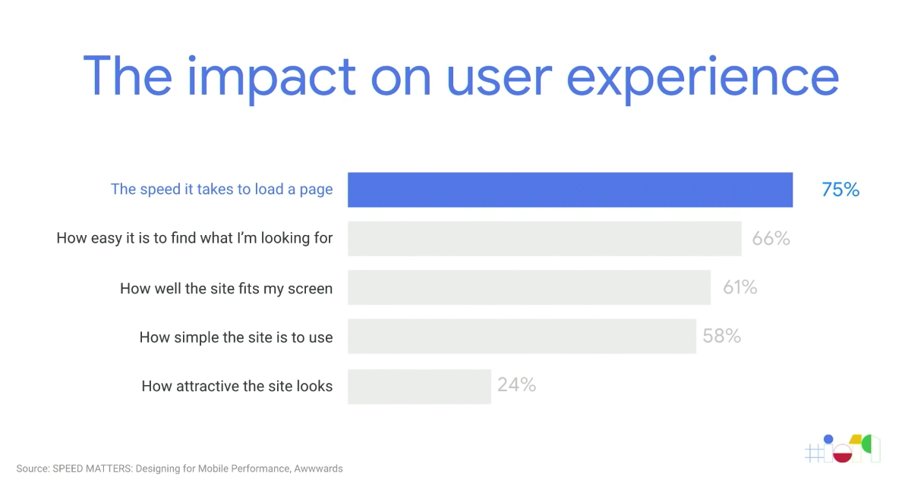
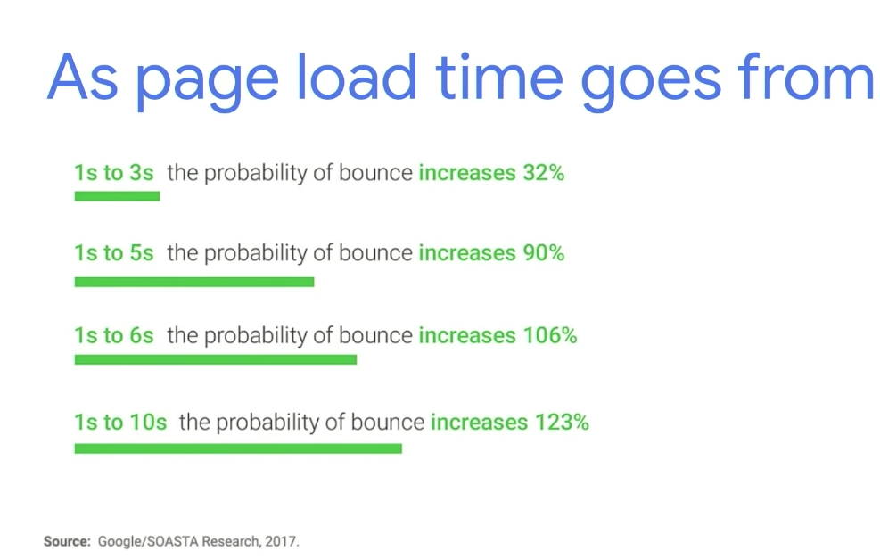
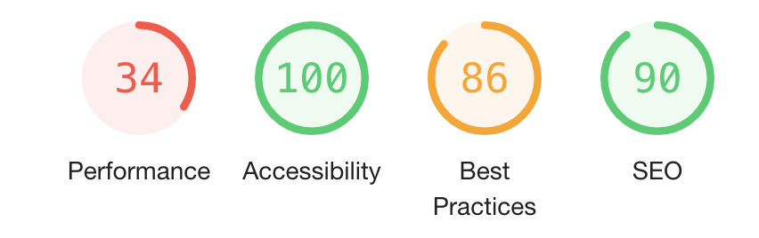
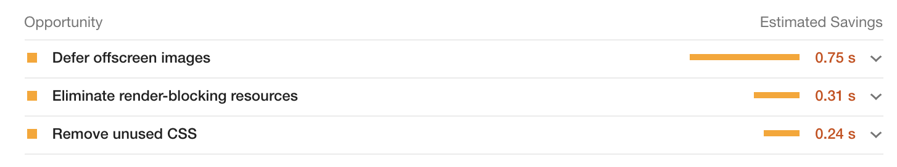

_This is the first in a series I'm doing on Google's Lighthouse tool. Lighthouse is an ["open-source, automated tool for improving the quality of web pages"](https://developers.google.com/web/tools/lighthouse). You can find more information on it at [Google's I/O '19 talk](https://www.youtube.com/watch?v=mLjxXPHuIJo)._

What's the most important thing to you when visiting a website? Is it accessibility, is it responsiveness, or is it how intuitive it feels? Well according to Google, it's 🔥speed🔥, and it's not subjective. Speed, in this context, refers to how fast or how slow a page loads. The first graphic below shows that the time it takes to load a page is the **most** important factor in a users mobile experience.

The following graphic was a google study on bounce. "Bounce" occurs when a user exits a page that's still loading. A bounced user is one that's never even glanced at your webpage. We're all guilty of this, wether it's a blank page or a loading spinner, patience is not a virtue we on the web value. In fact, the below graphic states, "as page load time goes from 1s to 5s the probability of bounce increases 90%".

Since speed is essential to any good website, I decided to audit AirBnB. They've been innovators in the frontend space, so I want to know how well their homepage performs by Google's standards. How likely are users to bounce? Here's how they did:

The biggest takeaway is that failing Performance score . There is an estimated ~1.5s of savings in page load time. It's not terrible but remember when I said, "as page load time goes from 1s to 5s the probability of bounce increases by 90%" ? Every second counts here and there is tons of opportunity for improvement. "Opportunities" are exactly what Lighthouse calls them, easy fixes that can generate big returns on losses. Let's take a look at their biggest "opportunities".

"Defer offscreen images" is a techy way of saying, let people use your site **before** all the images load. A lot of websites are implementing lazy loading where users see a blurry preview of the picture before it loads. Check out any Medium article for a well known example of this. In a speed first approach to building websites, it's much better to let users interact with your site before all those bulky images load.

"Eliminate render-blocking resources", oof more tech-speak. Basically a website should show you a page before it has all the data. AirBnB has the challenge of showing up-to-date listings, so they kind of need data to show content 😬. Something Facebook and Reddit have been doing more is rendering a placeholder animation. These placeholders outline where data will be and make it look less like a loading screen and more like actual content. I bet most people don't even notice these little animations which is exactly what Reddit wants.

"Remove unused CSS" is pretty clear. Most likely a developer forgot to remove a deprecated stylesheet and it hasn't been caught (common mistake tbh). This is the power of Lighthouse, something simple like deleting an old stylesheet will save AirBnB .24s.

All this is easier said than done, but the importance of it is clear. Speed is the web's most valuable commodity and Google's Lighthouse is a powerful tool to gain some more. It'll be great for our users once more and more developers start using it 😇.
